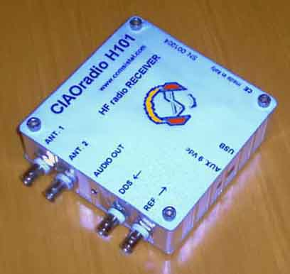

ExtIO_H101.dll
===========

by Oscar Steila IK1XPV

Based on original work:
 * Winrad specifications for the external I/O DLL by Alberto di Bene I2PHD
 
 see: [Winrad Extio.dll](http://www.winrad.org/bin/Winrad_Extio.pdf) 

## Description
CIAOradio H101 was one of the firsts Hamradio SDR receiver by Claudio Re I1RFQ and Oscar Steila IK1XPV in 2004. 

The ExtIO_H101.dll as been realized to enable the use of many SDR program that uses ExtIO interface with H101 hardware. 

ExtIO_H101 early test using: 

[HDSDR](http://www.hdsdr.de/) 

[SDRsharper](http://www.qsl.net/sdr)

[WinradF](http://www.adaptableobjects.com/Ham%20Radio/PM-SDR/SDR%20Software/WinradF/WinradF%201.5.zip)

Copy Extio_H101.dll into the SDR application directory and then select the ExtIO_H101 from the SDR application setup.

### Required Library

ExtIO_H101.dll uses RTaudio library
RtAudio: a set of realtime audio i/o C++ classes by Gary P. Scavone

[The RtAudio Home Page](https://www.music.mcgill.ca/~gary/rtaudio/)

[Version 4.1.1](http://www.music.mcgill.ca/~gary/rtaudio/release/rtaudio-4.1.1.tar.gz)

## H101 Historical links:

[7° Convention Digital & Radio Communications i-LINK Renon 2005  (slides, 2005 - Italian )](http://www.steila.com/CIAOradio/doc/Renon2005.pdf)

[Ciao Radio H101 - IK1QLD (2005 - Italian )](http://www.brunero.it/drm/ciaoradio/CiaoRadioColor.pdf)

[Radio & Communication Info: CiaoRadio, la nuova frontiera (provata) (2006 - Italian )](http://radiodxinfo.blogspot.it/2006/01/ciaoradio-la-nuova-frontiera-provata.html)

[Ham Station IWØHK: Sistel Ciaoradio H101: test-set e ricevitore hf Sdr (2006 - Italian )](http://www.mediasuk.org/iw0hk/articolo_ciaoradio.htm)

[FUNKAMATEUR 11/2006: Willkommen: CIAO Radio H101 - ein softwaredefinierter Empfanger (2006 - German)](http://www.wimo.com/download/ciaoradio_test_aus_funkamateur_11_06.pdf)

[www.steila.com/blog](http://www.steila.com/blog/index.php?controller=page&action=view&id_page=2)

## Thanks to

Alberto di Bene, I2PHD

Claudio Re, I1RFQ

Ivan Guerini, IW2KBK

